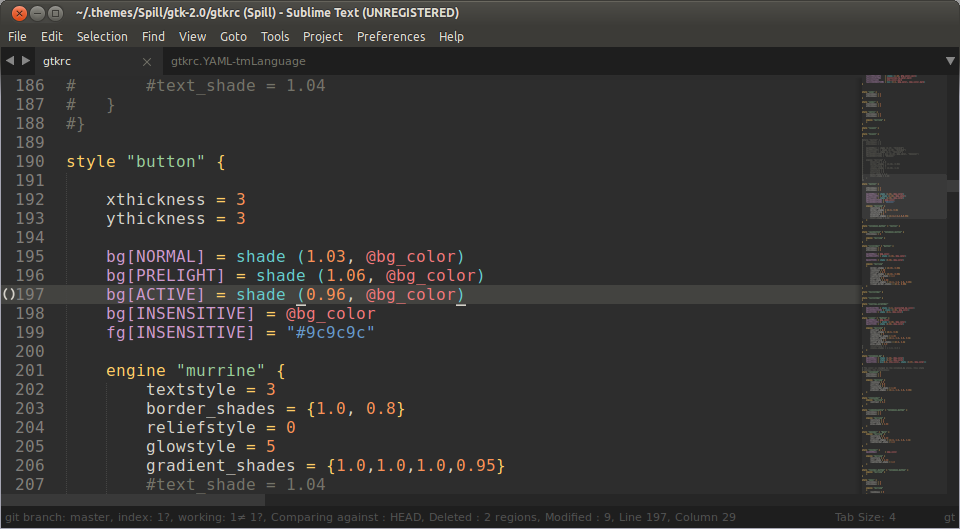

# .gtkrc syntax definitions for Sublime Text

This is my pretty dumb solution for `.gtkrc` syntax highlighting in Sublime Text.

## Disclaimer

This is my first syntax definition file, and it is horrible. Really. Just look at its source. You will see. It may not even work / look good with other color themes, since my primary intention was to create a great looking syntax highlight for the theme **I** use, as quickly as possible.

**So if it doesn't work well with your colors, feel free to tweak it to your liking.**

## Features

Can highlight special keywords, comments, string constants, numeric constants, color variable references, hexadecimal color definitions and "array" usages.

(This language is a mess by the way.)

## Installation

Just throw the `gtkrc.tmLanguage` in your `Packages/User` folder.

## Editing

To edit the syntax definition, you have to install the [AAAPackageDev](https://github.com/SublimeText/AAAPackageDev) package, which can turn YAML syntax definitions into XML ones processed by Sublime Text. With it, you can easily "build" the XML by opening the YAML file and pressing F7.

## Contribution

Feel free to suggest changes, fork, modify, anything. I would appreciate your help.

## FAQ

(These questions have not been asked even once, I just wanted to write some more, hehe)

### Why?
I was editing / fine-tuning a GTK2 theme and I got tired of not having a syntax definition for these kind of files, so I quickly made one sufficient enough for my usage.

### What is the color scheme on the screenshot?
Eighties Dark from the [Base16 family](https://github.com/chriskempson/base16). Tried and used many others, but I just can't switch away from this theme.

## License

MIT.